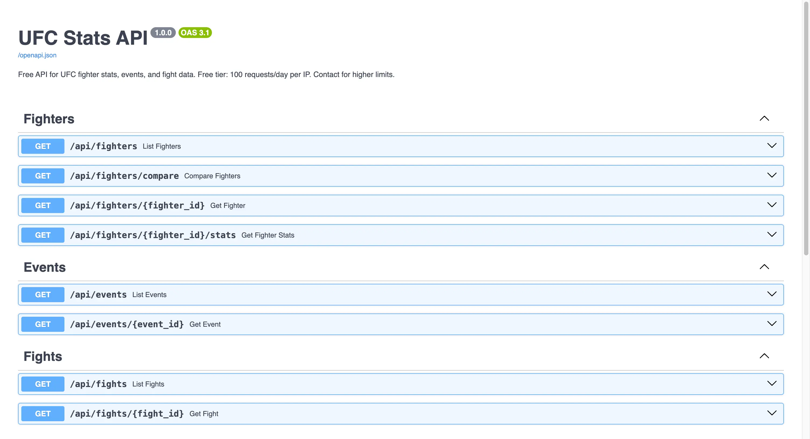

# UFC Stats API

A free REST API for UFC fighter stats, events, and fight data.



**Live API:** https://ufcapi.aristotle.me

**Docs:** https://ufcapi.aristotle.me/docs

## Data

- 4,400+ fighters with career stats and fight history
- 750+ events with full fight cards
- 8,500+ fights with round-by-round statistics

## Features

- **Rate Limiting**: 100 requests/day per IP (+ 100/min burst protection)
- **Response Caching**: 5-minute cache for faster responses
- **CORS Enabled**: Use from any frontend application

## Endpoints

| Endpoint | Description |
|----------|-------------|
| `GET /` | API info |
| `GET /health` | Health check |
| `GET /docs` | Interactive documentation |

### Fighters

| Endpoint | Description |
|----------|-------------|
| `GET /api/fighters` | List fighters (pagination, search, filters) |
| `GET /api/fighters/{id}` | Fighter details with fight history |
| `GET /api/fighters/{id}/stats` | Fighter career statistics |
| `GET /api/fighters/compare?fighter1=ID&fighter2=ID` | Compare two fighters |

### Events

| Endpoint | Description |
|----------|-------------|
| `GET /api/events` | List all events |
| `GET /api/events/{id}` | Event details with fight card |

### Fights

| Endpoint | Description |
|----------|-------------|
| `GET /api/fights` | List fights |
| `GET /api/fights/{id}` | Fight details with round-by-round stats |

### Stats

| Endpoint | Description |
|----------|-------------|
| `GET /api/stats/leaders?stat=slpm` | Stat leaders (slpm, td_avg, wins, etc.) |
| `GET /api/stats/overview` | Database overview |

## Examples

```bash
# List fighters
curl https://ufcapi.aristotle.me/api/fighters?limit=10

# Search for a fighter
curl https://ufcapi.aristotle.me/api/fighters?search=mcgregor

# Get fighter by ID
curl https://ufcapi.aristotle.me/api/fighters/f4c49976c75c5ab2

# Compare two fighters
curl "https://ufcapi.aristotle.me/api/fighters/compare?fighter1=f4c49976c75c5ab2&fighter2=032cc3922d871c7f"

# Get events
curl https://ufcapi.aristotle.me/api/events?limit=5

# Get fight details
curl https://ufcapi.aristotle.me/api/fights/3eea92e7f26fb05b

# Stat leaders
curl https://ufcapi.aristotle.me/api/stats/leaders?stat=slpm&limit=10
```

## Response Format

All responses are JSON. Example fighter response:

```json
{
  "id": "f4c49976c75c5ab2",
  "name": "Conor McGregor",
  "record": "22-6-0",
  "wins": 22,
  "losses": 6,
  "draws": 0,
  "height": "5' 9\"",
  "weight": "155 lbs.",
  "reach": "74\"",
  "stance": "Southpaw",
  "slpm": 5.32,
  "str_acc": 0.49,
  "td_avg": 0.67,
  "fights": [...]
}
```

## License

For personal and non-commercial use. UFC data belongs to UFC/Zuffa LLC.

---

🥊 Built by [Aristotle](https://aristotle.me) for UFC nerds who debate stats at 2am 🤓
